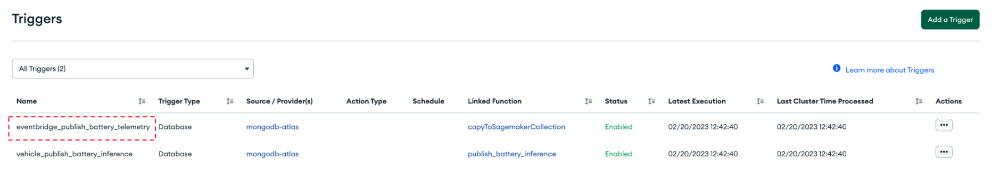

# Setup Instructions for MongoDB and Amazon SageMaker Integration

To configure the first 3 parts of your Digital Twin, please refer to the [Vehicle-Digital-Twin-Feedback-Loop repository](https://github.com/mongodb-industry-solutions/Digital-Twins-With-AWS). 


# Step-by-step instructions

## Setup the AWS Backend
1. Create an [AWS Account](https://portal.aws.amazon.com/billing/signup#/start/email).
2. Take note of your AWS Account ID as you'll need it to update your AWS Account ID in `./Connected-Vehicle/triggers/eventbridge_publish_battery_telemetry.json`
3. To publish battery telemetry information to Eventbridge, please follow these steps in MongoDB Atlas under the App Services tab: 
       
      * Navigate to the "Triggers" tab
       
      * Click on your eventbridge_publish_battery_telemetry trigger: 
      
      
      
      * Under the "Function" Section select "EventBridge" as the Event Type
      
           * Update your AWS Account ID 
              
           * Select an AWS Region 

     
       
      * Now expand the advanced options and copy/paste the following code into the Project Expression: 
      
      ```json 
               {
                     "operationType": {
                      "$numberInt": "1"
                  },
                  "vin": "$fullDocument.vin",
                  "read": {
                      "$map": {
                          "input": "$fullDocument.measurements",
                          "as": "item",
                          "in": [
                              "$$item.voltage",
                              "$$item.current"
                          ]
                      }
                  }
              }
      ```
       
      * You should see the following: 
     


## Setup SageMaker 

pls refer the [link](https://docs.aws.amazon.com/sagemaker/latest/dg/studio-launch.html#studio-launch-console-prerequisites) for prerequisites and setup of Sagemaker domain , if it's not done earlier.

Deploy the SageMaker model "Predictive Maintenance for Vehicle Fleets" to get the end-point.


## Building the Code
Replace the SageMaker end-point with the one generated above [here](https://github.com/mongodb-partners/Vehicle-Digital-Twin-Solution/blob/main/code/push_to_mdb/write_to_mdb.py#L13).

## Lambda Functions
Create two lambda functions:

1. For pulling the data from MongoDB cluster, refer this [function](https://github.com/mongodb-partners/Vehicle-Digital-Twin-Solution/blob/main/code/pull_from_mdb).
2. For pushing the predicted data back to MongoDB cluster, refer this [function](https://github.com/mongodb-partners/Vehicle-Digital-Twin-Solution/blob/main/code/push_to_mdb).

Please follow this [guide](https://docs.aws.amazon.com/lambda/latest/dg/images-create.html).

## Create Rules for AWS Eventbus
### 1. Eventbus for capturing MongoDB changes

Add the rule name, description and the eventbus from the dropdown.


Select the first option for Event source to pull data from MongoDB.


Select options for Event source, Partner and Event type as selected below. 


Add previously created Lambda as target and create the rule.


### 2. Eventbus for capturing events sent from Lambda function  

This rule is created to move data between lambda functions.


Select other when selecting event source.


Add below event pattern to be able to send data using python function.
```
{
    "source": ["user-event"],
    "detail-type": ["user-preferences"]
}
```


## Sample output
On simulating the connected vehichle application the volatage and current of the vehichle are analysed for percentage of failure. The inference is stored back in MongoDB Atlas.


# Conclusion
This gives a working template to setup an end-to-end flow for connected vehicles, to analyze its telemetric data using MongoDB Atlas and AWS Services. 

Return to [Part 4](https://github.com/mongodb-industry-solutions/Digital-Twins-With-AWS/blob/main/aws-sagemaker/README.md), if you are interested in running the [Vehicle-Digital-Twin-Feedback-Loop](https://github.com/mongodb-industry-solutions/Digital-Twins-With-AWS/blob/main/Demo_Instructions.md)! 

For any further information, please contact partners@mongodb.com

<standard>
